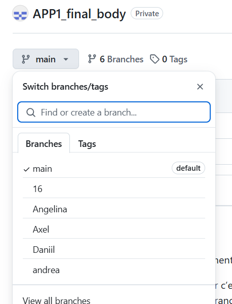

**Les filles et les garçons,**  

Je vais essayer de vous expliquer rapidement ce que j’ai compris ici.  

Nous allons tous travailler sur GitHub, car c’est plus pratique. Cela ne change rien, à part la manière dont vous partagez vos fichiers. Nous aurons une branche principale appelée "main", avec le fichier principal (attention à bien faire cette distinction). Pour chacun d’entre nous, je vais créer une branche personnelle où chacun pourra travailler sur ses fichiers pour simplifier la démarche. En clair, lorsque vous vous rendrez sur GitHub, vous verrez dans les branches vos noms, et vous devrez travailler dessus.  

Le principe des branches est le suivant : dès que vous avez travaillé sur votre code, **N’OUBLIEZ JAMAIS DE FAIRE UN COMMIT avec un commentaire ET ENSUITE DE PUSHER**. Ensuite, nous pourrons "merger" ce que vous avez sur vos branches.  

Par exemple, si j’ai besoin de récupérer ce qu’Angelina a fait sur sa branche, elle devra d’abord faire un commit, puis pusher sur sa branche. De mon côté, en restant sur ma branche, je vais merger sa branche avec la mienne (merger est un peu comme un "pull", mais entre les branches, car "pull" se fait entre votre VS Code et GitHub, tandis que "merge" se fait entre deux branches). De cette façon, j’aurai tout ce qu’elle a fait.  

Attention : parfois, je pourrais avoir écrit des choses supplémentaires sur un fichier qu’elle n’a pas modifiées. Dans ce cas, après le merge, il faudra accepter les deux modifications (vous comprendrez en voyant l’interface).  

Enfin, **NE MERGEZ JAMAIS AVEC LA BRANCHE MAIN**. Nous ferons cela à la fin, lorsque nous combinerons toutes les branches ensemble.  

Si vous rencontrez un problème, écrivez-le dans la section "Issues" sur GitHub.  

